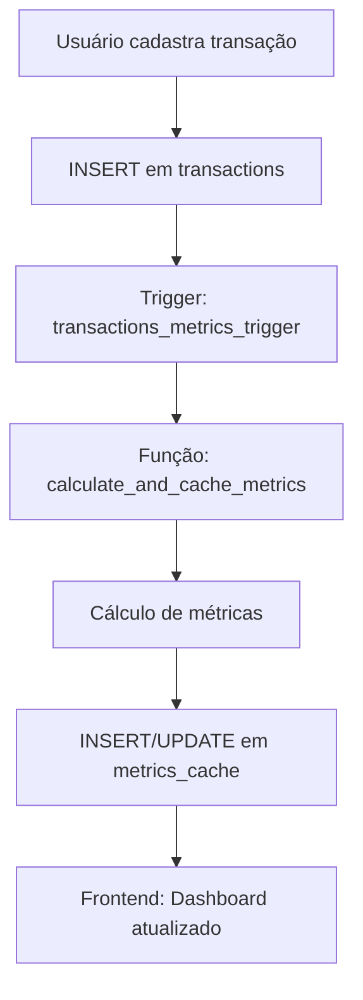

# Arquitetura do DRE Infinity

## 🎯 Visão Geral

O **DRE Infinity** é uma plataforma SaaS completa de gestão financeira que automatiza o cálculo de DRE (Demonstração do Resultado do Exercício) e oferece métricas avançadas para tomada de decisão estratégica.

---

## 🏗️ Arquitetura Técnica

### Stack Tecnológico

**Frontend:**
- React 18 + TypeScript
- Vite (Build tool)
- Tailwind CSS + shadcn/ui
- TanStack Query (State management)
- Recharts (Gráficos)

**Backend:**
- Supabase (BaaS)
- PostgreSQL (Database)
- Row Level Security (RLS)
- Edge Functions (Serverless)

**Integrações:**
- Stripe (Pagamentos - em implementação)

---

## 📊 Fluxo de Dados



---

## 🗄️ Estrutura do Banco de Dados

### Tabelas Principais

#### `companies`
Armazena dados das empresas dos usuários.
- `id`, `name`, `tax_id`, `tax_regime`, `owner_id`

#### `transactions`
Todas as movimentações financeiras.
- `id`, `company_id`, `category_id`, `amount`, `transaction_date`
- `is_marketing_cost`, `is_sales_cost`, `is_new_client`, `client_id`

#### `dre_categories`
Categorias da DRE (Receitas, Custos, Despesas).
- `id`, `company_id`, `name`, `category_type`, `cost_classification`

#### `metrics_cache`
Cache de métricas calculadas automaticamente.
- `id`, `company_id`, `period_month`, `period_year`
- `net_revenue`, `cac`, `ltv`, `roi`, `average_ticket`, `break_even_point`

#### `cash_vaults`
Cofres virtuais do módulo Caixa.
- `id`, `company_id`, `vault_type`, `current_balance`

#### `cash_transactions`
Transações entre cofres.
- `id`, `company_id`, `vault_type`, `transaction_type`, `amount`, `tags`

#### `subscriptions`
Planos e assinaturas dos usuários.
- `id`, `user_id`, `plan`, `status`, `trial_ends_at`, `stripe_subscription_id`

---

## 🔐 Segurança (RLS Policies)

Todas as tabelas implementam Row Level Security:

```sql
-- Exemplo: Transactions
CREATE POLICY "Users can view their company transactions"
ON transactions FOR SELECT
USING (
  EXISTS (
    SELECT 1 FROM companies 
    WHERE companies.id = transactions.company_id 
    AND companies.owner_id = auth.uid()
  )
);
```

---

## 🚀 Sistema de Planos (Freemium)

### Functional (R$ 97/mês)
- Dashboard + Lançamentos ilimitados
- Relatórios DRE básicos
- 1 empresa

### Growth (R$ 197/mês)
- Tudo do Functional +
- Metas, Break-even, Cenários
- Até 3 empresas

### Infinity (R$ 397/mês)
- Tudo do Growth +
- Empresas ilimitadas
- Módulo Caixa completo
- API + Consultoria

**Trial:** 14 dias grátis em todos os planos

---

## 📈 Módulos do Sistema

### 1. Dashboard (`/dashboard`)
- KPIs: Lucro Líquido, Receita, CAC, LTV, ROI
- Gráficos de evolução mensal
- Indicadores de metas

### 2. Lançamentos (`/transactions`)
- Cadastro de transações
- Filtros avançados
- Associação com clientes

### 3. Relatórios DRE (`/reports`)
- DRE completo automático
- Análise Vertical (% AV)
- Análise Horizontal (% AH)
- Exportação Excel

### 4. Metas (`/goals`)
- Definição de metas por métrica
- Comparação Realizado vs Meta
- Progress indicators

### 5. Break-Even (`/break-even`)
- Ponto de Equilíbrio
- Margem de Segurança
- Margem de Contribuição

### 6. Cenários (`/scenarios`)
- Simulador de estratégias
- Projeção de impactos

### 7. Caixa (`/cash-flow`)
- Saldo Total e Líquido
- Cofres: Reserva, Capital, Investimentos, Retiradas
- Histórico de movimentações

### 8. Planos (`/pricing`)
- Comparação de planos
- Upgrade/Downgrade
- Gestão de assinatura

---

## 🔄 Cálculo Automático de Métricas

### Trigger SQL
```sql
CREATE TRIGGER transactions_metrics_trigger
AFTER INSERT OR UPDATE OR DELETE ON transactions
FOR EACH ROW EXECUTE FUNCTION trigger_recalculate_metrics();
```

### Métricas Calculadas
- CAC = (Marketing + Vendas) / Novos Clientes
- LTV = Ticket Médio × 12 meses
- ROI = ((Receita Líquida - Custos) / Custos) × 100
- Break-Even = Custos Fixos / Taxa de Margem de Contribuição

---

## 📱 Responsividade

- **Mobile-first**: Design otimizado para dispositivos móveis
- **Breakpoints Tailwind**: sm (640px), md (768px), lg (1024px), xl (1280px)
- **Componentes adaptativos**: Sidebar colapsável, badges responsivas

---

## 🎨 Design System

**Tokens CSS:**
```css
--primary: 262.1 83.3% 57.8%
--secondary: 220 14.3% 95.9%
--success: 142.1 76.2% 36.3%
```

**Componentes:**
- GlassCard (efeito glassmorphism)
- GradientText (texto com gradiente)
- Button variants (default, outline, hero, glow)

---

Para mais informações, consulte os arquivos de código fonte e migrações SQL em `supabase/migrations/`.
